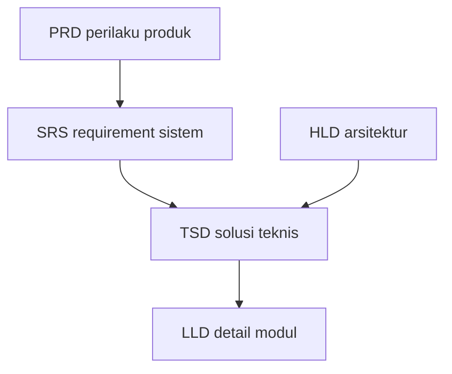

# TSD (Technical Specification Document)

Artikel ini menjelaskan **peran TSD** dalam rantai dokumentasi, **hubungannya dengan PRD/SRS/HLD/LLD**, **isi yang biasanya ada**, serta **kesalahan umum** yang membuat spesifikasi teknis cepat kedaluwarsa atau tidak dapat dieksekusi oleh tim engineering.

---

## 1. Definisi singkat

**TSD (Technical Specification Document)** adalah dokumen yang menjelaskan **bagaimana solusi teknis** akan memenuhi requirement yang telah disepakati: komponen perangkat lunak, kontrak layanan, model data tingkat layanan, integrasi, keputusan dependency, pola kegagalan, dan kriteria teknik untuk **implementasi serta review**.

TSD menjawab **desain solusi dan batas sistem teknis**, sering bersinggungan dengan **HLD** (gambaran besar) dan **LLD** (detail modul), tetapi organisasi dapat menggabung atau memecah nama sesuai kebiasaan mereka.

---

## 2. Tujuan utama TSD

1. **Menyelaraskan engineering** tentang komponen yang dibangun, siapa pemiliknya, dan bagaimana berinteraksi.
2. **Memperjelas kontrak integrasi** antar tim (frontend/backend/platform) dan dengan sistem eksternal.
3. **Mengurangi rework** dengan menetapkan asumsi performa, skema error, dan idempotensi di awal.
4. **Dasar estimasi** yang lebih akurat daripada PRD saja.
5. **Dasar code review** dan inspeksi arsitektur untuk fitur besar.

---

## 3. Audiens utama

| Peran | Manfaat |
|--------|---------|
| **Engineer implementasi** | Panduan boundary modul dan API internal. |
| **Platform / SRE** | Kebutuhan infrastruktur, observabilitas, rollout. |
| **Security / architect** | Threat surface, kontrol akses, data flow. |
| **Vendor** | Scope integrasi jika pekerjaan outsource sebagian. |

---

## 4. Relasi dengan dokumen lain

- **SRS** membatasi **apa** yang harus dipenuhi; **TSD** menjelaskan **desain yang diusulkan** untuk memenuhi SRS.
- **ADR** mencatat keputusan besar; TSD merinci implikasi di level fitur/rilis.
- **OpenAPI** bisa menjadi lampiran atau sumber kebenaran—TSD menjelaskan konteks dan trade-off, bukan menduplikasi setiap field jika sudah otomatis dari spec.

---

## 5. Isi tipikal TSD

1. **Ringkasan teknis** — konteks, link PRD/SRS, ruang lingkup teknis.
2. **Diagram konteks / container** — sistem boundary (C4 level ringkas).
3. **Komponen dan tanggung jawab** — layanan, modul, tim owning.
4. **Alur request utama** — urutan sinkron/async, timeout, retry policy.
5. **Kontrak API** — referensi OpenAPI, versi, deprecation policy jika ada.
6. **Model data layanan** — entitas dominan, konsistensi, idempotency key.
7. **Keamanan** — authN/Z, secret handling, enkripsi, PII/PHI flow.
8. **Observabilitas** — metrik, log, trace; korelasi ID.
9. **Deployment & config** — feature flag, migrasi skema, backward compatibility.
10. **Risiko teknis & mitigasi** — fallback, circuit breaker, degradasi terkendali.
11. **Kriteria selesai teknis** — definisi siap merge/deploy untuk tim.

---

## 6. Level detail yang tepat

TSD yang terlalu tinggi menyisakan ruang salah paham; terlalu rendah menduplikasi kode.

Aturan praktis:

- Cantumkan **kontrak antar komponen** dan **state penting** (misalnya mesin status rujukan).
- Hindari menyalin **alur bisnis panjang** yang sudah ada di PRD—cukup merujuk.

---

## 7. Non-functional di TSD

Nyatakan target teknis yang dapat diverifikasi:

- Latency budget per hop, ukuran payload referensi.
- Batas konkurensi, queue depth, policy DLQ untuk async.
- Kebijakan cache dan invalidasi jika mempengaruhi konsistensi klinis/bisnis.

---

## 8. Versi dan hidup dokumen

TSD mengikuti siklus fitur: **Draft → Review arsitek → Approved for implementasi**. Perubahan setelah freeze harus melalui catatan revisi; dampak pada QA dan rollout harus eksplisit.

---

## 9. Kesalahan umum

- **TSD = salinan SRS** tanpa desain konkret.
- **Tidak ada trade-off** — satu solusi digambarkan sebagai satu-satunya tanpa alternatif yang ditolak.
- **Kontrak API tersebar** di Slack tanpa konsolidasi di spec.
- **Mengabaikan migrasi data** dan kompatibilitas mundur.
- **Keamanan diduga** — “kami pakai HTTPS” tanpa alur token dan scope.

---

## 10. Ringkasan

TSD adalah **peta teknis** untuk satu inisiatif atau fitur besar: ia menghubungkan requirement yang sudah disepakati dengan **keputusan integrasi, kontrak, dan operasi** yang dibutuhkan developer dan platform. Dokumen ini termasuk yang sering dipakai developer karena menjadi **titik acuan saat implementasi**—asalkan dijaga hidup dan tidak bertentangan dengan repository kode yang sebenarnya.
